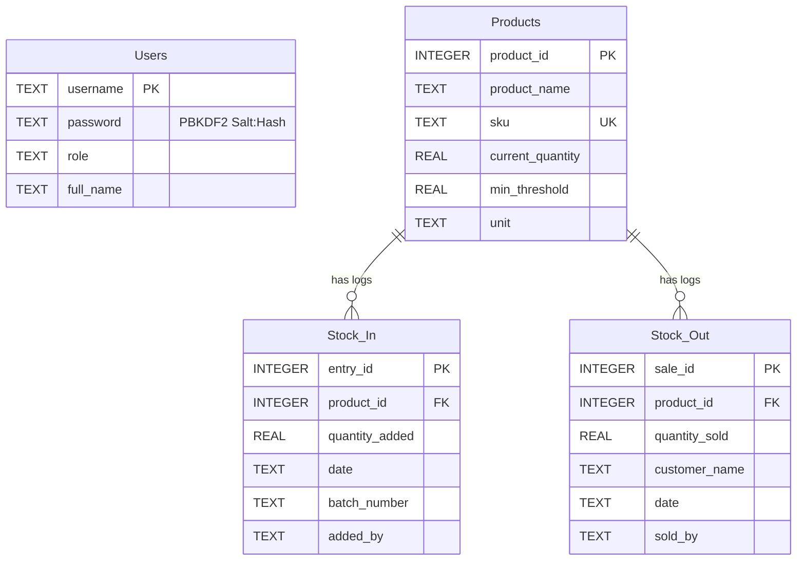

# Quantify Ledger - System Documentation

Quantify Ledger is a secure, concurrent, and highly scalable inventory management system designed for manufacturing warehouses. It provides real-time tracking of assets, manufacturing inflows, sales/deliveries dispatches, and provides a robust historical audit trail.

---

## 1. System Architecture

The application is structured as a single-host Node.js web application utilizing a modern, decoupled web architecture:

```
                  ┌──────────────────────────────────────────────┐
                  │                 Vite Client                  │
                  │  (React 19 / TypeScript / Tailwind v4 / UI)  │
                  └──────┬────────────────────────────────┬──────┘
                         │                                │
                 HTTP Requests                       Static Assets
              (JWT Auth Header)                     (CSS, JS, HTML)
                         │                                │
                         ▼                                ▼
                  ┌──────────────────────────────────────────────┐
                  │              Express Server API              │
                  │   (Express 4 / Node.js Runtime / tsx Host)   │
                  └──────┬───────────────────────────────────────┘
                         │
                 Serialized Queries
               (Atomic Transactions)
                         │
                         ▼
                  ┌──────────────────────────────────────────────┐
                  │               SQLite Database                │
                  │            (relational storage)              │
                  └──────────────────────────────────────────────┘
```

### Backend Architecture
- **Runtime Host**: Node.js utilizing `tsx` in development for live execution, compiled to pure CJS via `esbuild` for production.
- **Web Framework**: Express.js with custom middleware filters for session validation, authentication headers, and role access permissions.
- **Database Layer**: Relational SQLite3 database (`inventory.db`) with active foreign key checking (`PRAGMA foreign_keys = ON;`) and customized lock contention thresholds (`PRAGMA busy_timeout = 5000;`).

### Frontend Architecture
- **Framework**: React 19 written in TypeScript.
- **Styling & Assets**: Tailwind CSS v4 with curated design tokens (using Google Font families `Inter` and `JetBrains Mono`). Icon library powered by `lucide-react`.
- **Bundler**: Vite dev server in development, bundled to optimized production assets (`/dist`) for deployment.

---

## 2. Relational Database Schema

Quantify Ledger stores all credentials, catalog metadata, and ledger transaction entries in four relational tables:



### 2.1 Table Columns & Constraints

#### Users Table
Stores employee authentication accounts and administrative classifications.
```sql
CREATE TABLE Users (
    username TEXT PRIMARY KEY,
    password TEXT NOT NULL, -- Stored as "salt:pbkdf2_sha512_hash"
    role TEXT NOT NULL,     -- 'Administrator' or 'Warehouse Staff'
    full_name TEXT NOT NULL
);
```

#### Products Table
Stores catalog items, inventory descriptions, and safety thresholds.
```sql
CREATE TABLE Products (
    product_id INTEGER PRIMARY KEY AUTOINCREMENT,
    product_name TEXT NOT NULL,
    sku TEXT UNIQUE NOT NULL,
    current_quantity REAL DEFAULT 0,
    min_threshold REAL DEFAULT 0,
    unit TEXT NOT NULL
);
```

#### Stock_In Table
Stores logs detailing inwards movement (purchasing, manufacturing, restocks).
```sql
CREATE TABLE Stock_In (
    entry_id INTEGER PRIMARY KEY AUTOINCREMENT,
    product_id INTEGER NOT NULL,
    quantity_added REAL NOT NULL,
    date TEXT NOT NULL,          -- Format: YYYY-MM-DDTHH:MM
    batch_number TEXT,
    added_by TEXT NOT NULL,      -- Username of the recording staff
    FOREIGN KEY (product_id) REFERENCES Products (product_id) ON DELETE CASCADE
);
```

#### Stock_Out Table
Stores logs detailing outwards movement (customer dispatches, orders, sales).
```sql
CREATE TABLE Stock_Out (
    sale_id INTEGER PRIMARY KEY AUTOINCREMENT,
    product_id INTEGER NOT NULL,
    quantity_sold REAL NOT NULL,
    customer_name TEXT NOT NULL,
    date TEXT NOT NULL,
    sold_by TEXT NOT NULL,       -- Username of the recording staff
    FOREIGN KEY (product_id) REFERENCES Products (product_id) ON DELETE CASCADE
);
```

---

## 3. Core Architectural Solutions

To build a professional, industry-grade ledger, several critical limitations of the initial system were solved:

### 3.1 Security & Stateful Guarding
- **Secure Password Hashing**: Avoids plain-text leaks by using Node's PBKDF2 algorithm (`crypto.pbkdf2Sync` with SHA-512, 1000 iterations, and a unique 16-byte random salt per user).
- **Automated Password Migration**: On boot, the server scans the database for plain-text credentials and automatically migrates them into the secure salt-hash format transparently.
- **Stateless JWT Tokens**: Custom-signed JSON Web Tokens (`HS256` utilizing the HMAC-SHA256 signature scheme) expire after 24 hours. They authenticate the user identity statelessly on every API endpoint.
- **Role-Based Guards**: Restricts modifications to authorized users. For example, adding new products requires the `Administrator` role, while standard stock logs can be written by `Warehouse Staff`.

### 3.2 Stock Concurrency & Database Integrity
- **Process-Level Write Mutex**: A Promise-based execution queue (`Mutex`) on the Express server serializes all write operations (`POST` requests). This completely prevents SQLite's concurrent nested transaction conflicts (the "cannot start a transaction within a transaction" error).
- **Atomic Transactions**: All mutations are wrapped in database transaction blocks (`BEGIN IMMEDIATE`, `COMMIT`, `ROLLBACK`). If any sub-statement fails, the database rolls back to its original state.
- **Validation in Queries**: Insufficient stock conditions are prevented by conducting subtraction validations inside the SQL operation itself:
  ```sql
  UPDATE Products 
  SET current_quantity = current_quantity - ? 
  WHERE product_id = ? AND current_quantity >= ?
  ```
  If no row matches the condition, the quantity remains untouched, and the transaction is safely rolled back.

### 3.3 Server-Side Pagination & High Scaling
- **Database Pagination**: Endpoints support `page` and `limit` arguments. The API dynamically calculates total page statistics and fetches specific rows using `LIMIT` and `OFFSET` queries.
- **Database Search & Filters**: Search parameters perform SQL `LIKE` wildcard matching. Category filters (e.g. *Low Stock*) run comparisons directly in database memory rather than transmitting raw datasets to the browser.
- **Form Dropdown Cache**: To prevent paginating form selection dropdowns (which would hide products outside page 1), the client maintains a separate, unpaginated cache (`allProducts` fetched using `limit=10000`) for input controls.

---

## 4. API Endpoints Reference

All requests must set a `Content-Type: application/json` header. With the exception of `/api/login`, all routes require a header parameter: `Authorization: Bearer <JWT_TOKEN>`.

### 4.1 Authentication

#### `POST /api/login`
Authenticates a user and generates a stateless session token.
- **Payload**:
  ```json
  { "username": "admin", "password": "admin123" }
  ```
- **Response (200 OK)**:
  ```json
  {
    "success": true,
    "user": {
      "username": "admin",
      "role": "Administrator",
      "full_name": "Jane Doe (Admin)",
      "token": "eyJhbGciOiJIUzI1NiIsInR5cCI6IkpXVCJ9..."
    }
  }
  ```

---

### 4.2 Products Management

#### `GET /api/products`
Retrieves products dynamically based on search terms, filter states, and page counts.
- **Query Params**:
  - `page` (optional): Page number (Default: `1`).
  - `limit` (optional): Records per page (Default: `10`).
  - `search` (optional): SKU or product name search string.
  - `filter` (optional): Set to `"low"` to fetch low stock items.
- **Response (200 OK)**:
  ```json
  {
    "products": [
      {
        "product_id": 2,
        "product_name": "Copper Cable 2.5mm",
        "sku": "CC-25MM-002",
        "current_quantity": 45,
        "min_threshold": 100,
        "unit": "Meters",
        "is_low_stock": 1
      }
    ],
    "pagination": { "page": 1, "limit": 1, "totalItems": 4, "totalPages": 4 }
  }
  ```

#### `POST /api/products` *(Admin Only)*
Registers a new product in the catalog ledger.
- **Payload**:
  ```json
  {
    "product_name": "Galvanized Steel Sheets",
    "sku": "GSS-GALV-001",
    "unit": "Pieces",
    "min_threshold": 20,
    "current_quantity": 0,
    "added_by": "admin"
  }
  ```
- **Response (201 Created)**:
  ```json
  {
    "success": true,
    "product": {
      "product_id": 6,
      "product_name": "Galvanized Steel Sheets",
      "sku": "GSS-GALV-001",
      "current_quantity": 0,
      "min_threshold": 20,
      "unit": "Pieces"
    }
  }
  ```

---

### 4.3 Ledger Entries

#### `POST /api/stock-in`
Registers inward inventory and increases the product stock volume.
- **Payload**:
  ```json
  {
    "product_id": 2,
    "quantity_added": 50,
    "date": "2026-05-31T12:00",
    "batch_number": "BATCH-RESTOCK-01",
    "added_by": "warehouse"
  }
  ```
- **Response (200 OK)**:
  ```json
  {
    "success": true,
    "product": { ... }
  }
  ```

#### `GET /api/stock-in`
Retrieves paginated logs for inward restocks. Supports `page`, `limit`, and `search`.

#### `POST /api/stock-out`
Records an outward delivery. Deducts the product stock atomically.
- **Payload**:
  ```json
  {
    "product_id": 2,
    "quantity_sold": 10,
    "customer_name": "Tesla Motors Ltd",
    "date": "2026-05-31T14:30",
    "sold_by": "warehouse"
  }
  ```
- **Response (200 OK)**:
  ```json
  {
    "success": true,
    "product": { ... }
  }
  ```

#### `GET /api/stock-out`
Retrieves paginated logs for outward sales. Supports `page`, `limit`, and `search`.

---

### 4.4 Dashboard Stats

#### `GET /api/dashboard-stats`
Aggregates summary statistics for display on the dashboard banner.
- **Response (200 OK)**:
  ```json
  {
    "totalSKUs": 5,
    "lowStockAlerts": 3,
    "totalInflow": 1390,
    "totalOutflow": 60
  }
  ```

---

## 5. Client Component Map

- **`Login.tsx`**: Renders the secure sign-in page, validates credentials against the backend API, and triggers session creation.
- **`App.tsx`**: The main application routing controller. Manages tab selection states, active user sessions, token expiry logouts, and handles API fetching triggers.
- **`Dashboard.tsx`**: Renders the core ledger view:
  - KPI banners displaying total SKUs, low stock warnings, and flow metrics.
  - Interactive product catalog table including a status checker (OK vs. REORDER).
  - Bottom pagination controls: rows-per-page selector, interactive page buttons, and total entries indicators.
  - Modal overlay for product registration (restricted to Administrators).
- **`HistoryLogs.tsx`**: Displays the audit ledger, divided into two sub-views: *Inward Restocks* and *Outward Deliveries*. Each sub-view has dedicated search inputs and independent pagination panels.
- **`StockInForm.tsx`** & **`StockOutForm.tsx`**: Provide validation forms to record stock transactions, referencing the full catalog dropdown options.

---

## 6. Development and Verification

### 6.1 Setup & Running Locally
Ensure Node.js is installed.

1. **Install dependencies**:
   ```bash
   npm.cmd install
   ```
2. **Start the development host**:
   ```bash
   npm.cmd run dev
   ```
   *The server dynamically sets up `inventory.db` and starts listening at `http://localhost:3000`.*
3. **Compile production build**:
   ```bash
   npm.cmd run build
   ```

### 6.2 Running Verification Tests
The project contains integration test files inside the artifacts directory:

- **Authentication Test**:
  ```bash
  node C:\Users\shakt\.gemini\antigravity-ide\brain\485a9c42-1936-4ae9-b376-b34411430f51\scratch\test_auth.js
  ```
- **Concurrency Test**:
  ```bash
  node C:\Users\shakt\.gemini\antigravity-ide\brain\485a9c42-1936-4ae9-b376-b34411430f51\scratch\test_concurrency.js
  ```
- **Pagination Test**:
  ```bash
  node C:\Users\shakt\.gemini\antigravity-ide\brain\485a9c42-1936-4ae9-b376-b34411430f51\scratch\test_pagination.js
  ```
